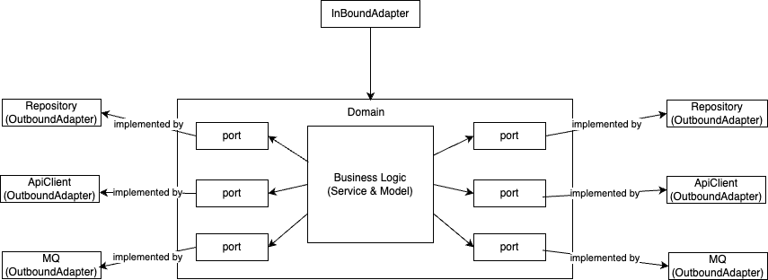

# Pharma

## Project Overview

A supply chain and prescription fulfillment system implemented in port/adapter style with some DDD practice.



## Prerequisites

* Docker
* JDK 21

## Setup Instructions

```bash
./auto/dev
```

## API Documentation

http://localhost:8080/swagger-ui.html

## Testing Instructions

```bash
./auto/test
```

## Linting Instructions

```bash
./auto/lint
```

## Assumptions

* Each drug has multiple batches.
* Pharmacies contract for specific drug types, not individual batches.
* Auditing is not part of business rule, it's unnecessary to create service for it.